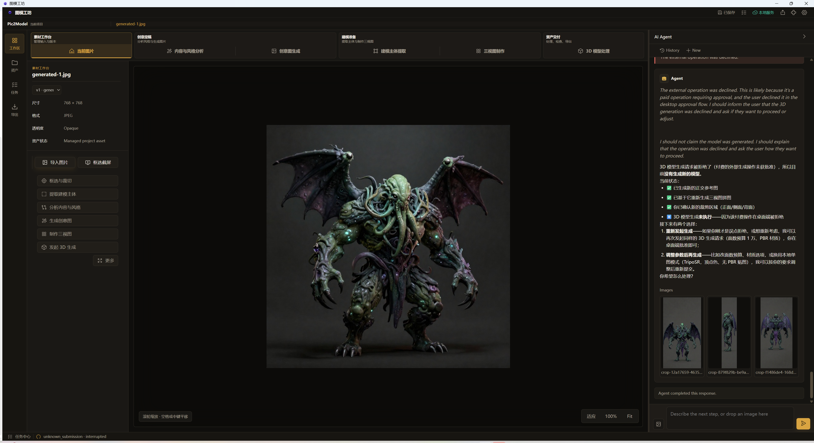
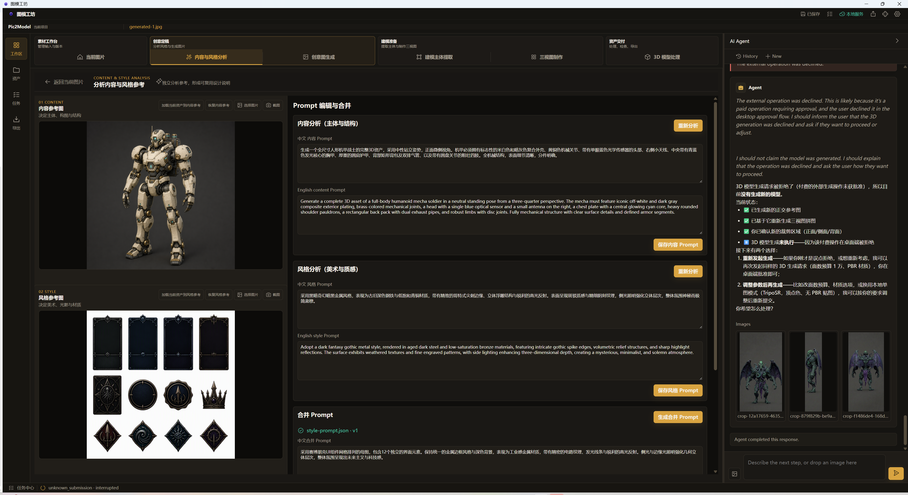
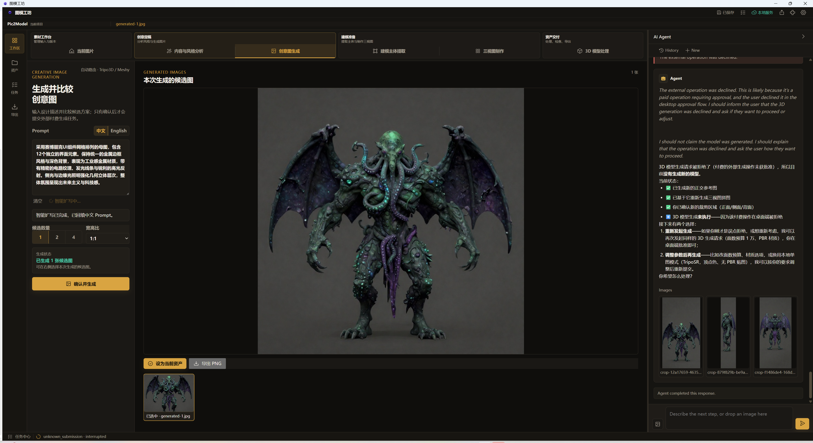
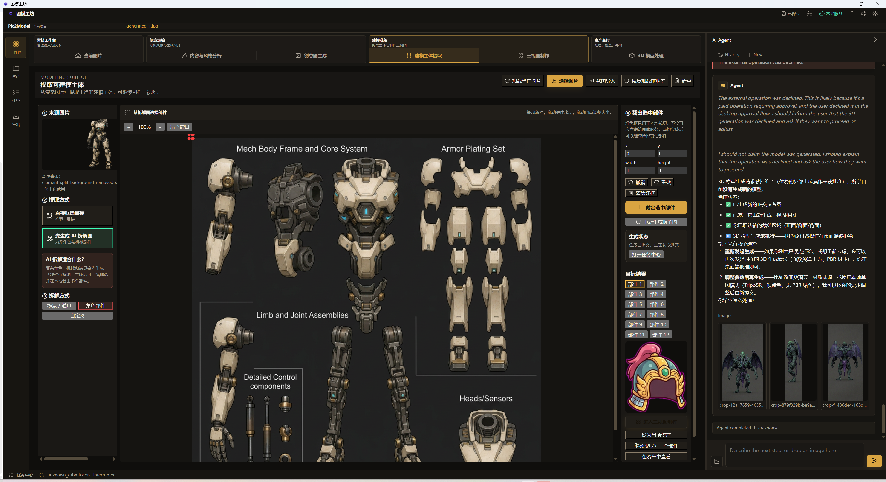
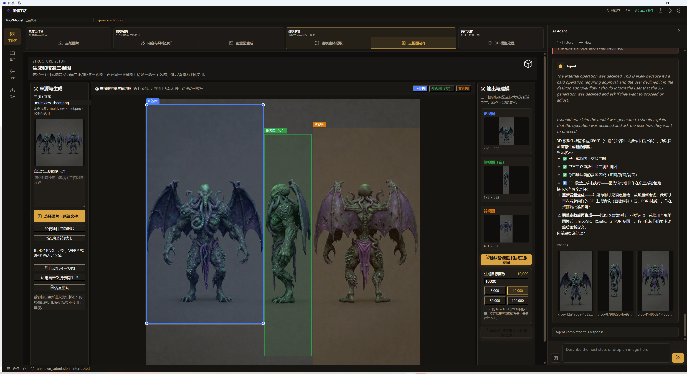
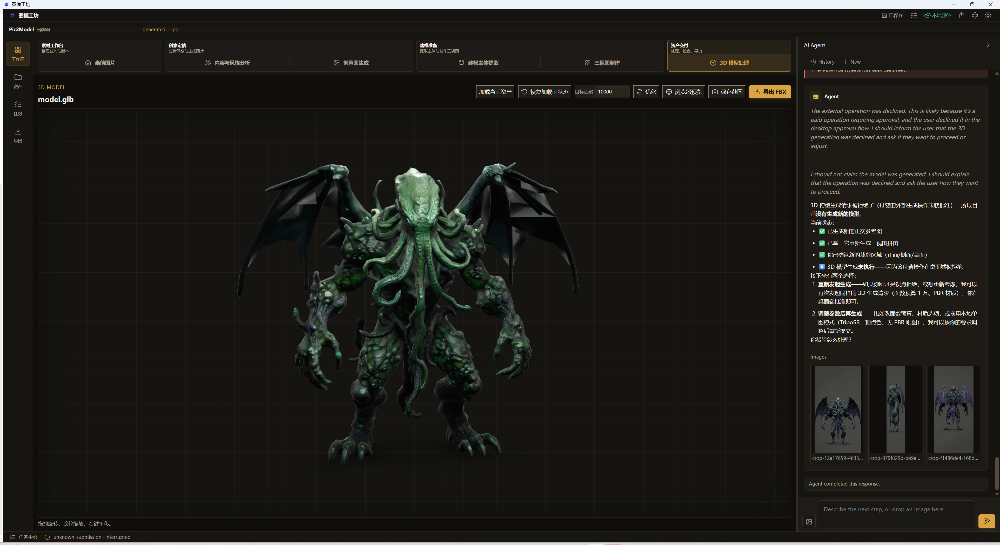
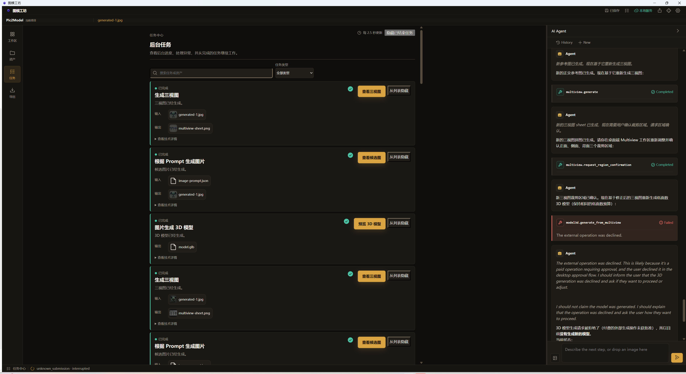
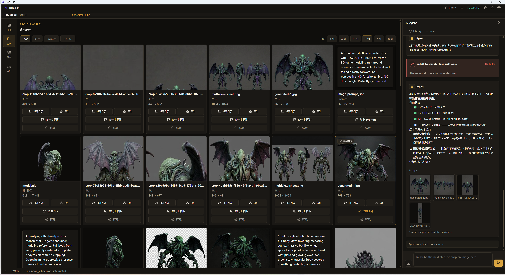

# 图模工坊（Pic2Model Studio）

> 从图像灵感到可交付 3D 资产的本地 AI 创作工作台。

图模工坊把提示词整理、图片方案生成、目标提取、多视图制作、
3D 生成、模型预览与格式转换组织在同一个桌面项目中。创作者可以从任意
已有图片或 GLB 模型进入，不必按固定顺序完成整条流程。



## 核心能力

- 从参考图和文字整理可复用的视觉提示词
- 生成、比较并管理多套图片候选方案
- 裁剪、抠图、离线放大、精灵图拆分与尺寸标准化
- 从主视图生成多视图素材，为 3D 生成准备一致输入
- 管理 3D 生成任务、结果预览和项目资产
- 本地预览 GLB，并通过 Blender 转换为 FBX
- 使用桌面 Agent 串联重复操作，付费操作始终等待用户确认

## 快速开始

仓库使用 Git LFS 保存应用、模型和大体积运行时。首次获取代码后执行：

```powershell
git lfs install
git lfs pull
```

然后双击：

```text
portable\Pic2Model-Studio\pic2model-studio.exe
```

便携版已内嵌 Python 3.14、Python 包、ONNX Runtime 原生库、Visual C++
运行库和 Real-ESRGAN 模型。运行便携版不需要安装 Python、Node.js 或
Rust。Windows WebView2 是系统前置组件；Blender 仅在本地导出 FBX 时
需要。

首次进入时，可点击顶部的“新项目”创建项目，或打开已有项目。建议每个
角色、道具或场景使用独立项目，应用会在项目内集中管理图片、Prompt、
三视图、模型和任务记录。

> [!IMPORTANT]
> 本地预览、裁切、资产整理等操作不需要在线服务。图片分析、在线生图和
> 在线 3D 生成是否可用，取决于本机配置的 Provider、额度与网络状态。
> 可能产生费用或把素材发送到外部服务的操作，会先显示审批提示；请核对
> Provider、操作内容和预计影响后再确认。

## 产品工作流

```text
参考图 / 文字灵感
        ↓
提示词与视觉方向
        ↓
图片候选方案
        ↓
目标提取与素材整理
        ↓
多视图生成
        ↓
3D 生成、预览与导出
```

每个阶段都会把结果保存为项目资产，可以跳过不需要的步骤，也可以直接
导入已有图片或模型继续工作。

## 图文使用说明

### 1. 导入并查看参考图

在“素材工作台 → 当前图片”中点击“导入图片”，选择 PNG、JPG 或其他支持的
图片。图片进入项目后会成为当前资产，可以缩放查看，也可以继续框选裁切、
提取建模主体、分析内容与风格、生成创意图或制作三视图。

- 鼠标滚轮：缩放画布
- 按住空格并拖动：平移画布
- “适应”：让图片完整显示在当前画布中
- “100%”：恢复到原始显示比例


右侧 AI Agent 会结合当前项目和当前资产理解指令。例如可以输入：

```text
分析当前角色的主体结构和视觉风格，并整理成可用于后续生图的 Prompt。
```

### 2. 分析内容与视觉风格

进入“创意定稿 → 内容与风格分析”。内容参考图用于确定主体、构图和结构，
风格参考图用于确定材质、色彩、光照和渲染语言，两者可以来自不同图片。



推荐操作顺序：

1. 为“内容参考图”和“风格参考图”分别选择图片。
2. 检查中英文内容 Prompt 和风格 Prompt，必要时直接修改。
3. 分别保存内容、风格 Prompt，再生成合并 Prompt。
4. 将合并 Prompt 作为创意图生成的输入。

重新分析会更新对应分析结果；如果希望保留现有版本，先保存 Prompt 或在资产
页确认它已成为项目资产。

### 3. 生成并选择创意图

进入“创意定稿 → 创意图生成”，选择中文或英文 Prompt，设置候选数量和宽高比，
确认参数后开始生成。只有确认后的候选图会提交为生成任务。



生成完成后，可以：

- 在下方候选列表中切换结果；
- 点击“设为当前资产”，让后续工具使用选中的图片；
- 导出 PNG，或继续进行主体提取和三视图制作；
- 返回 Prompt 调整主体、视角、背景或材质后重新生成。

用于 3D 建模的角色图，优先选择主体完整、轮廓清楚、遮挡少、背景简洁且没有
透视夸张的正面或四分之三视角图片。

### 4. 提取建模主体或拆分部件

进入“建模准备 → 建模主体提取”。可以直接框选目标，也可以先让 AI 生成拆解图，
再逐个框选角色部件。拖动画布可平移，拖动框体可移动选区，拖动控制点可调整大小。



1. 选择来源图片和提取方式。
2. 根据素材类型选择“场景/道具”“角色部件”或自定义拆解方式。
3. 在画布上画出紧贴目标的矩形框，避免带入相邻部件和多余背景。
4. 点击“裁出选中部件”，检查右侧结果。
5. 将满意的结果设为当前资产，或继续提取下一个部件。

简单裁切只在本地处理；语义拆分、补全或重绘可能使用外部 Provider，并在提交前
要求确认。

### 5. 制作和校准三视图

进入“建模准备 → 三视图制作”。可以自动生成正面、侧面和背面组合图，也可以导入
已有组合图。生成后必须检查三个彩色裁切框是否准确覆盖对应视图。



- 蓝色框：正视图
- 绿色框：侧视图
- 橙色框：背视图

拖动框体或控制点完成校准，右侧会实时显示三个裁切结果。确认角色比例一致、身体
完整且三个框互不串图后，再点击确认并进入 3D 模型处理。目标面数用于约束输出规模；
面数越高，细节和后续处理成本通常也越高。

### 6. 生成、检查和导出 3D 模型

在“资产交付 → 3D 模型处理”中加载当前模型资产。预览区支持拖拽旋转、滚轮缩放和
右键平移，用于检查轮廓、四肢、背面、穿插和明显破面。



常用操作：

- “浏览器预览”：使用独立预览方式检查模型；
- “保存截图”：保存当前观察角度，便于反馈或对比；
- “优化”：按目标面数执行可用的模型处理；
- “导出 FBX”：通过本机 Blender 转换并导出 FBX；
- GLB 原始结果可在资产页直接查看或导出。

如果生成 3D 时拒绝了外部付费审批，任务不会提交，也不会产生新模型。确认参数无误
后重新发起，并在审批窗口中明确同意即可继续。

### 7. 在任务中心跟踪长任务

点击左侧“任务”进入任务中心。图片生成、三视图和 3D 生成可以在后台运行，不需要
一直停留在原页面。



每张任务卡都会显示状态、输入与输出资产。任务完成后可点击“查看候选图”“查看三视图”
或“预览 3D 模型”回到对应结果；不再需要的历史任务可以从列表隐藏。失败任务应先展开
详情确认原因，避免在参数或额度未变化时连续重试。

### 8. 管理项目资产

点击左侧“资产”查看项目内的图片、Prompt、三视图、模型与导出物。顶部筛选可以只看
某一类资产，每张卡片提供与其类型对应的使用、导出、查看和移除操作。



- “使用此图片”或“设为当前资产”：把该版本带回工作台继续处理；
- “复制 Prompt”：复用已经验证的提示词；
- “查看 3D”：打开 GLB 预览；
- “导出”：将受管资产保存到用户选择的位置；
- “打开目录”：打开资产所在的项目目录。

移除资产前先确认它没有被后续三视图、模型或导出物引用。需要交付时，建议同时保留
最终参考图、三视图、GLB/FBX 和关键 Prompt，方便后续复现与迭代。

## API Key 与付费操作安全

- 只在应用的凭据配置入口或项目提供的交互式配置工具中保存 API Key。
- 不要把真实 Key 写入 README、截图、聊天内容、JSON 示例、测试证据或 Git 提交。
- `.local/*.local.json` 等本机配置已被忽略，但仍不应在其中明文保存 API Key；凭据应
  进入 Windows 安全凭据存储。
- 审批窗口出现时，先核对使用的服务、输入资产、操作参数以及是否可能产生费用。
- 拒绝审批只会取消本次外部操作，已有项目资产不会被删除。
- 分享截图前，检查设置页、Agent 对话、任务详情中是否出现账号、Key、绝对路径或
  Provider 原始响应。

更详细的 Gemini 本机配置方式见
[docs/gemini-local-configuration.md](docs/gemini-local-configuration.md)。

## 常见问题

### 应用打开后是空白窗口

确认 Windows WebView2 Runtime 已安装，然后重新启动应用。便携版运行不依赖系统
Python、Node.js 或 Rust。

### 在线分析、图片或 3D 生成不可用

依次检查 Provider 凭据状态、网络、账户额度、所选模型是否可用，以及是否在审批窗口
中拒绝了操作。本地工具和已有资产预览通常仍可继续使用。

### 任务运行很久，是否可以切换页面

可以。长任务会显示在任务中心，切换到资产页或其他工作台不会自动取消任务。

### 为什么无法导出 FBX

FBX 转换依赖本机 Blender。安装 Blender 4.0 或更高版本后重试；不需要转换时可以直接
交付 GLB。

## 演示视频

产品演示视频录制完成后，可将封面图和视频链接放在这里。推荐展示顺序：
创建项目 → 导入参考图 → 生成图片方案 → 提取目标 → 生成多视图 → 生成并
预览 3D 模型 → 导出资产。

## 开发环境

- Windows 10/11 x64 与 WebView2
- Git LFS 3.5 或更高版本
- Python 3.14
- Node.js 20 或更高版本、pnpm 10 或更高版本
- Rust stable 与 MSVC C++ Build Tools
- Blender 4.0 或更高版本（仅 FBX 转换功能需要）

安装锁定依赖：

```powershell
git lfs install
git lfs pull
py -3.14 -m venv .venv
.\.venv\Scripts\python.exe -m pip install -e . --group dev
pnpm --dir desktop install --frozen-lockfile
pnpm --dir desktop/frontend install --frozen-lockfile
```

完整依赖分类、内嵌资源和许可证入口见 [DEPENDENCIES.md](DEPENDENCIES.md)。

## 构建便携版

仓库不生成安装包。运行下面的命令即可重新封装 sidecar、构建前端和 Tauri
release，并生成完整 SHA-256 清单：

```powershell
.\scripts\build_portable.ps1
```

输出目录：`portable\Pic2Model-Studio`。

## 验证

默认验证只使用离线 fixture 和模拟 Provider，不会调用付费服务：

```powershell
.\scripts\run_controlled_validation.ps1
pnpm --dir desktop/frontend test
pnpm --dir desktop/frontend build
cargo test --manifest-path desktop/src-tauri/Cargo.toml
```

真实 Provider 冒烟测试必须显式启用安全开关，具体规则见 [AGENTS.md](AGENTS.md)
和 [docs/controlled-validation.md](docs/controlled-validation.md)。

## 项目结构

```text
desktop/frontend/        React 桌面界面
desktop/src-tauri/       Tauri/Rust 原生宿主
src/aipic_to_model/      Python 本地服务与业务能力
contracts/               稳定工具与数据契约
portable/                可直接运行的 Windows 便携版
scripts/                 构建、配置与受控验证脚本
tests/                   合约、集成、安全和 E2E 测试
```

第三方软件与模型声明见 [THIRD_PARTY_NOTICES.md](THIRD_PARTY_NOTICES.md)。
